# Awesome Autonomous Driving and Robotics Background

A reading roadmap for skimming essential computer vision, geometry, autonomous driving, and robot learning papers.

This roadmap prioritizes **conceptual shifts** and system-level background over simply listing the newest SOTA papers. Read each section as a small map: first understand the field evolution, then skim the papers in order, then use the video links only when the vocabulary feels unfamiliar.

Last updated: 2026-06-05

## At a Glance

| Layer | What to build intuition for | Sections |
|---|---|---|
| 2D perception | Detect, segment, and track objects in images and video. | [2D Object Detection](#1-2d-object-detection), [Segmentation and Scene Parsing](#2-segmentation-and-scene-parsing), [Object Tracking](#3-object-tracking-and-multi-object-tracking) |
| Geometry | Recover depth, camera motion, correspondence, and 3D structure. | [Depth Estimation and Stereo](#4-depth-estimation-and-stereo), [Multiple View Geometry and 3D Vision](#5-multiple-view-geometry-and-3d-vision) |
| Driving perception | Lift camera features into 3D and BEV representations. | [3D Object Detection and BEV Perception](#6-3d-object-detection-and-bev-perception), [SLAM, Odometry, and Occupancy](#7-slam-odometry-and-occupancy) |
| Decision making | Predict agent motion, plan actions, and learn robot policies. | [Motion Forecasting](#8-motion-forecasting), [Planning and Control](#9-planning-and-control), [Robot Learning](#10-robot-learning) |
| Modern generalists | Use foundation models, world models, and safety tools. | [Foundation Models](#11-foundation-models-for-vision-and-robotics), [End-to-End Autonomous Driving](#12-end-to-end-autonomous-driving), [Generative Vision and World Models](#13-generative-vision-and-world-models), [Robustness, Uncertainty, and Safety](#14-robustness-uncertainty-and-safety) |

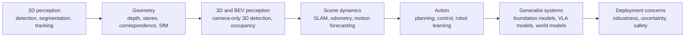

## Table of Contents

- [1. 2D Object Detection](#1-2d-object-detection)
- [2. Segmentation and Scene Parsing](#2-segmentation-and-scene-parsing)
- [3. Object Tracking and Multi-Object Tracking](#3-object-tracking-and-multi-object-tracking)
- [4. Depth Estimation and Stereo](#4-depth-estimation-and-stereo)
- [5. Multiple View Geometry and 3D Vision](#5-multiple-view-geometry-and-3d-vision)
- [6. 3D Object Detection and BEV Perception](#6-3d-object-detection-and-bev-perception)
- [7. SLAM, Odometry, and Occupancy](#7-slam-odometry-and-occupancy)
- [8. Motion Forecasting](#8-motion-forecasting)
- [9. Planning and Control](#9-planning-and-control)
- [10. Robot Learning](#10-robot-learning)
- [11. Foundation Models for Vision and Robotics](#11-foundation-models-for-vision-and-robotics)
- [12. End-to-End Autonomous Driving](#12-end-to-end-autonomous-driving)
- [13. Generative Vision and World Models](#13-generative-vision-and-world-models)
- [14. Robustness, Uncertainty, and Safety](#14-robustness-uncertainty-and-safety)

## 1. 2D Object Detection

### Field Evolution

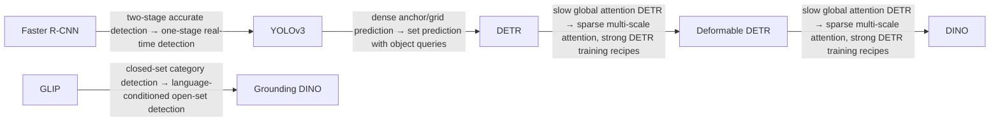

### Reading Order

1. [Faster R-CNN: Towards Real-Time Object Detection with Region Proposal Networks](https://arxiv.org/abs/1506.01497), NeurIPS 2015  
   Skim for: <kbd>region proposal networks</kbd>, <kbd>two-stage detection</kbd>, <kbd>anchors</kbd>, <kbd>RoI heads</kbd>

2. [YOLOv3: An Incremental Improvement](https://arxiv.org/abs/1804.02767), 2018  
   Skim for: <kbd>one-stage detection</kbd>, <kbd>real-time inference</kbd>, <kbd>multi-scale prediction</kbd>

3. [End-to-End Object Detection with Transformers](https://arxiv.org/abs/2005.12872), ECCV 2020  
   Skim for: <kbd>DETR</kbd>, <kbd>object queries</kbd>, <kbd>Hungarian matching</kbd>, <kbd>NMS-free detection</kbd>

4. [Deformable DETR: Deformable Transformers for End-to-End Object Detection](https://arxiv.org/abs/2010.04159), ICLR 2021  
   Skim for: <kbd>sparse multi-scale attention</kbd>, <kbd>faster DETR convergence</kbd>

5. [DINO: DETR with Improved DeNoising Anchor Boxes for End-to-End Object Detection](https://arxiv.org/abs/2203.03605), ICLR 2023  
   Skim for: <kbd>denoising training</kbd>, <kbd>anchor design</kbd>, <kbd>strong DETR recipe</kbd>

6. [Grounded Language-Image Pre-training](https://arxiv.org/abs/2112.03857), CVPR 2022  
   Skim for: <kbd>phrase grounding</kbd>, <kbd>vision-language pretraining</kbd>, <kbd>open-vocabulary detection</kbd>

7. [Grounding DINO: Marrying DINO with Grounded Pre-Training for Open-Set Object Detection](https://arxiv.org/abs/2303.05499), 2023  
   Skim for: <kbd>text-conditioned detection</kbd>, <kbd>open-set detection</kbd>, <kbd>phrase grounding</kbd>

### YouTube Skim Resources

- [Stanford CS231n 2025 Lecture 9: Object Detection, Image Segmentation, Visualizing](https://www.youtube.com/watch?v=PTypu6GqEd4)  
  Use the detection parts first.

- [DETR paper explanation search](https://www.youtube.com/results?search_query=DETR+paper+explained+object+detection+transformer)  
  Use this if Hungarian matching and object queries are unclear.

## 2. Segmentation and Scene Parsing

### Field Evolution

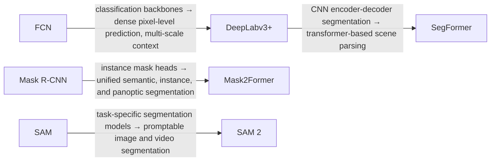

### Reading Order

1. [Fully Convolutional Networks for Semantic Segmentation](https://arxiv.org/abs/1411.4038), CVPR 2015  
   Skim for: <kbd>dense prediction</kbd>, <kbd>fully convolutional networks</kbd>, <kbd>pixel-level classification</kbd>

2. [Encoder-Decoder with Atrous Separable Convolution for Semantic Image Segmentation](https://arxiv.org/abs/1802.02611), ECCV 2018  
   Skim for: <kbd>DeepLabv3+</kbd>, <kbd>atrous convolution</kbd>, <kbd>semantic segmentation</kbd>

3. [SegFormer: Simple and Efficient Design for Semantic Segmentation with Transformers](https://arxiv.org/abs/2105.15203), NeurIPS 2021  
   Skim for: <kbd>transformer encoder</kbd>, <kbd>lightweight decoder</kbd>, <kbd>scene parsing</kbd>

4. [Mask R-CNN](https://arxiv.org/abs/1703.06870), ICCV 2017  
   Skim for: <kbd>RoIAlign</kbd>, <kbd>instance segmentation</kbd>, <kbd>mask prediction</kbd>

5. [Masked-attention Mask Transformer for Universal Image Segmentation](https://arxiv.org/abs/2112.01527), CVPR 2022  
   Skim for: <kbd>Mask2Former</kbd>, <kbd>semantic segmentation</kbd>, <kbd>instance segmentation</kbd>, <kbd>panoptic segmentation</kbd>

6. [Segment Anything](https://arxiv.org/abs/2304.02643), ICCV 2023  
   Skim for: <kbd>promptable segmentation</kbd>, <kbd>data engine</kbd>, <kbd>ambiguity-aware masks</kbd>

7. [SAM 2: Segment Anything in Images and Videos](https://arxiv.org/abs/2408.00714), 2024  
   Skim for: <kbd>video segmentation</kbd>, <kbd>memory</kbd>, <kbd>promptable tracking</kbd>

### YouTube Skim Resources

- [Stanford CS231n 2025 Lecture 9: Object Detection, Image Segmentation, Visualizing](https://www.youtube.com/watch?v=PTypu6GqEd4)  
  Use this for detection vs segmentation task taxonomy.

- [Semantic segmentation lecture search](https://www.youtube.com/results?search_query=semantic+segmentation+computer+vision+lecture+FCN+DeepLab+SegFormer)  
  Use before reading DeepLabv3+ and SegFormer.

## 3. Object Tracking and Multi-Object Tracking

### Field Evolution

### Reading Order

1. [Simple Online and Realtime Tracking](https://arxiv.org/abs/1602.00763), ICIP 2016  
   Skim for: <kbd>Kalman filtering</kbd>, <kbd>Hungarian matching</kbd>, <kbd>tracking-by-detection</kbd>

2. [Simple Online and Realtime Tracking with a Deep Association Metric](https://arxiv.org/abs/1703.07402), ICIP 2017  
   Skim for: <kbd>DeepSORT</kbd>, <kbd>appearance embeddings</kbd>, <kbd>data association</kbd>

3. [Tracktor++: Tracking without Bells and Whistles](https://arxiv.org/abs/1903.05625), ICCV 2019  
   Skim for: <kbd>detector regression</kbd>, <kbd>tracking-by-detection</kbd>

4. [CenterTrack: Tracking Objects as Points](https://arxiv.org/abs/2004.01177), ECCV 2020  
   Skim for: <kbd>joint detection and tracking</kbd>, <kbd>object centers</kbd>, <kbd>motion offsets</kbd>

5. [TrackFormer: Multi-Object Tracking with Transformers](https://arxiv.org/abs/2101.02702), CVPR 2022  
   Skim for: <kbd>tracking queries</kbd>, <kbd>DETR-style tracking</kbd>

6. [ByteTrack: Multi-Object Tracking by Associating Every Detection Box](https://arxiv.org/abs/2110.06864), ECCV 2022  
   Skim for: <kbd>low-confidence detections</kbd>, <kbd>association strategy</kbd>

7. [SAM 2: Segment Anything in Images and Videos](https://arxiv.org/abs/2408.00714), 2024  
   Skim for: <kbd>promptable video object tracking</kbd>, <kbd>segmentation memory</kbd>

### YouTube Skim Resources

- [Multi-object tracking lecture search](https://www.youtube.com/results?search_query=multi+object+tracking+computer+vision+lecture+SORT+DeepSORT)  
  Start here for Kalman filters and association.

- [ByteTrack paper explanation search](https://www.youtube.com/results?search_query=ByteTrack+paper+explained+multi+object+tracking)  
  Use this after SORT and DeepSORT.

## 4. Depth Estimation and Stereo

### Field Evolution

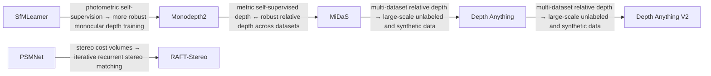

### Reading Order

1. [Unsupervised Learning of Depth and Ego-Motion from Video](https://arxiv.org/abs/1704.07813), CVPR 2017  
   Skim for: <kbd>photometric loss</kbd>, <kbd>ego-motion</kbd>, <kbd>self-supervised depth</kbd>

2. [Digging Into Self-Supervised Monocular Depth Estimation](https://arxiv.org/abs/1806.01260), ICCV 2019  
   Skim for: <kbd>Monodepth2</kbd>, <kbd>auto-masking</kbd>, <kbd>minimum reprojection loss</kbd>

3. [Pyramid Stereo Matching Network](https://arxiv.org/abs/1803.08669), CVPR 2018  
   Skim for: <kbd>stereo matching</kbd>, <kbd>cost volume</kbd>, <kbd>spatial pyramid pooling</kbd>

4. [RAFT-Stereo: Multilevel Recurrent Field Transforms for Stereo Matching](https://arxiv.org/abs/2109.07547), 3DV 2021  
   Skim for: <kbd>iterative refinement</kbd>, <kbd>stereo correspondence</kbd>

5. [Towards Robust Monocular Depth Estimation: Mixing Datasets for Zero-Shot Cross-Dataset Transfer](https://arxiv.org/abs/1907.01341), TPAMI 2022  
   Skim for: <kbd>MiDaS</kbd>, <kbd>relative depth</kbd>, <kbd>multi-dataset training</kbd>

6. [Depth Anything: Unleashing the Power of Large-Scale Unlabeled Data](https://arxiv.org/abs/2401.10891), CVPR 2024  
   Skim for: <kbd>large-scale unlabeled data</kbd>, <kbd>teacher-student training</kbd>

7. [Depth Anything V2](https://arxiv.org/abs/2406.09414), NeurIPS 2024  
   Skim for: <kbd>synthetic data</kbd>, <kbd>sharper predictions</kbd>, <kbd>practical model variants</kbd>

### YouTube Skim Resources

- [Monocular depth estimation lecture search](https://www.youtube.com/results?search_query=monocular+depth+estimation+computer+vision+lecture+self-supervised+depth)  
  Use this before Monodepth2 and MiDaS.

- [Stereo matching lecture search](https://www.youtube.com/results?search_query=stereo+matching+depth+estimation+computer+vision+lecture)  
  Use this before PSMNet or RAFT-Stereo.

## 5. Multiple View Geometry and 3D Vision

### Field Evolution

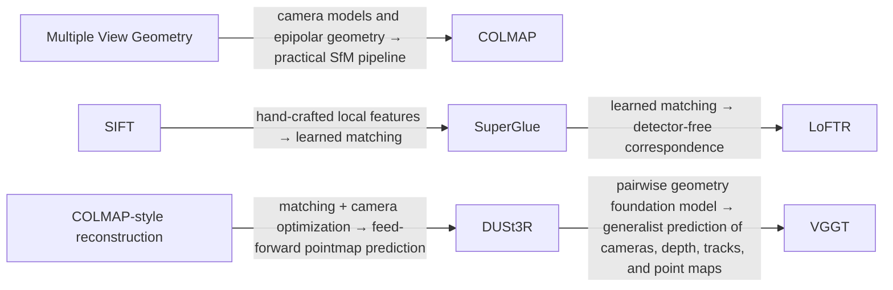

### Reading Order

1. [Multiple View Geometry in Computer Vision](https://www.robots.ox.ac.uk/~vgg/hzbook/), Hartley and Zisserman  
   Skim for: <kbd>camera models</kbd>, <kbd>epipolar geometry</kbd>, <kbd>fundamental matrix</kbd>, <kbd>triangulation</kbd>

2. [Distinctive Image Features from Scale-Invariant Keypoints](https://www.cs.ubc.ca/~lowe/papers/ijcv04.pdf), IJCV 2004  
   Skim for: <kbd>SIFT</kbd>, <kbd>local features</kbd>, <kbd>keypoint descriptors</kbd>, <kbd>feature matching</kbd>

3. [Structure-from-Motion Revisited](https://demuc.de/papers/schoenberger2016sfm.pdf), CVPR 2016  
   Skim for: <kbd>SfM pipeline</kbd>, <kbd>COLMAP</kbd>, <kbd>bundle adjustment</kbd>

4. [SuperGlue: Learning Feature Matching with Graph Neural Networks](https://arxiv.org/abs/1911.11763), CVPR 2020  
   Skim for: <kbd>local features</kbd>, <kbd>matching</kbd>, <kbd>attention-based correspondence</kbd>

5. [LoFTR: Detector-Free Local Feature Matching with Transformers](https://arxiv.org/abs/2104.00680), CVPR 2021  
   Skim for: <kbd>detector-free matching</kbd>, <kbd>coarse-to-fine correspondence</kbd>, <kbd>transformer matching</kbd>

6. [DUSt3R: Geometric 3D Vision Made Easy](https://arxiv.org/abs/2312.14132), CVPR 2024  
   Skim for: <kbd>pointmap prediction</kbd>, <kbd>unconstrained image pairs</kbd>, <kbd>reconstruction without calibrated cameras</kbd>

7. [VGGT: Visual Geometry Grounded Transformer](https://arxiv.org/abs/2503.11651), CVPR 2025  
   Skim for: <kbd>feed-forward prediction</kbd>, <kbd>cameras</kbd>, <kbd>depth maps</kbd>, <kbd>point maps</kbd>, <kbd>tracks</kbd>

### YouTube Skim Resources

- [Multiple view geometry lecture search](https://www.youtube.com/results?search_query=multiple+view+geometry+computer+vision+lecture+camera+pose+epipolar+geometry+triangulation)  
  Use this for camera pose, epipolar geometry, and triangulation.

- [COLMAP and SfM tutorial search](https://www.youtube.com/results?search_query=COLMAP+structure+from+motion+tutorial+bundle+adjustment)  
  Useful for practical SfM intuition.

## 6. 3D Object Detection and BEV Perception

This section focuses on **camera-centric** 3D detection and BEV perception. LiDAR and multimodal perception methods are intentionally left for a later expansion.

### Field Evolution

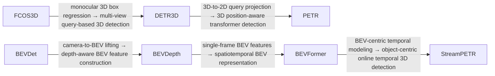

### Reading Order

1. [FCOS3D: Fully Convolutional One-Stage Monocular 3D Object Detection](https://arxiv.org/abs/2104.10956), ICCV Workshops 2021  
   Skim for: <kbd>monocular 3D detection</kbd>, <kbd>3D box parameterization</kbd>, <kbd>camera geometry</kbd>

2. [DETR3D: 3D Object Detection from Multi-view Images via 3D-to-2D Queries](https://arxiv.org/abs/2110.06922), CoRL 2021  
   Skim for: <kbd>multi-view cameras</kbd>, <kbd>3D queries</kbd>, <kbd>3D-to-2D projection</kbd>

3. [PETR: Position Embedding Transformation for Multi-View 3D Object Detection](https://arxiv.org/abs/2203.05625), ECCV 2022  
   Skim for: <kbd>3D position embedding</kbd>, <kbd>multi-view detection</kbd>

4. [BEVDet: High-performance Multi-camera 3D Object Detection in Bird-Eye-View](https://arxiv.org/abs/2112.11790), 2021  
   Skim for: <kbd>camera-to-BEV transformation</kbd>, <kbd>BEV feature learning</kbd>

5. [BEVDepth: Acquisition of Reliable Depth for Multi-view 3D Object Detection](https://arxiv.org/abs/2206.10092), AAAI 2023  
   Skim for: <kbd>depth-aware BEV</kbd>, <kbd>camera-only 3D detection</kbd>

6. [BEVFormer: Learning Bird's-Eye-View Representation from Multi-Camera Images via Spatiotemporal Transformers](https://arxiv.org/abs/2203.17270), ECCV 2022  
   Skim for: <kbd>BEV queries</kbd>, <kbd>spatial cross-attention</kbd>, <kbd>temporal self-attention</kbd>

7. [StreamPETR: Exploring Object-Centric Temporal Modeling for Efficient Multi-View 3D Object Detection](https://arxiv.org/abs/2303.11926), ICCV 2023  
   Skim for: <kbd>online 3D detection</kbd>, <kbd>object-centric temporal modeling</kbd>

### YouTube Skim Resources

- [BEV perception autonomous driving lecture search](https://www.youtube.com/results?search_query=BEV+perception+autonomous+driving+lecture+BEVFormer+DETR3D)  
  Use this to understand why BEV is a common representation for driving.

- [Camera-only 3D object detection explanation search](https://www.youtube.com/results?search_query=camera-only+3D+object+detection+DETR3D+BEVFormer+explained)  
  Use this before BEVFormer if 3D queries are unfamiliar.

## 7. SLAM, Odometry, and Occupancy

### Field Evolution

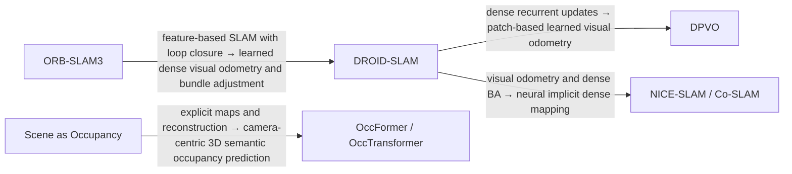

### Reading Order

1. [ORB-SLAM3: An Accurate Open-Source Library for Visual, Visual-Inertial and Multi-Map SLAM](https://arxiv.org/abs/2007.11898), T-RO 2021  
   Skim for: <kbd>feature-based SLAM</kbd>, <kbd>visual-inertial integration</kbd>, <kbd>loop closure</kbd>, <kbd>multi-map reuse</kbd>

2. [DROID-SLAM: Deep Visual SLAM for Monocular, Stereo, and RGB-D Cameras](https://arxiv.org/abs/2108.10869), NeurIPS 2021  
   Skim for: <kbd>learned recurrent updates</kbd>, <kbd>dense bundle adjustment</kbd>, <kbd>visual odometry</kbd>

3. [Deep Patch Visual Odometry](https://arxiv.org/abs/2208.04726), NeurIPS 2022  
   Skim for: <kbd>DPVO</kbd>, <kbd>patch graph</kbd>, <kbd>efficient learned VO</kbd>

4. [NICE-SLAM: Neural Implicit Scalable Encoding for SLAM](https://arxiv.org/abs/2112.12130), CVPR 2022  
   Skim for: <kbd>neural implicit mapping</kbd>, <kbd>dense reconstruction</kbd>, <kbd>tracking</kbd>

5. [Co-SLAM: Joint Coordinate and Sparse Parametric Encodings for Neural Real-Time SLAM](https://arxiv.org/abs/2304.14377), CVPR 2023  
   Skim for: <kbd>real-time neural SLAM</kbd>, <kbd>hybrid encodings</kbd>

6. [Scene as Occupancy](https://arxiv.org/abs/2306.02851), ICCV 2023  
   Skim for: <kbd>camera-only 3D occupancy prediction</kbd>, <kbd>scene completion</kbd>

7. [OccFormer: Dual-path Transformer for Vision-based 3D Semantic Occupancy Prediction](https://arxiv.org/abs/2304.05316), ICCV 2023  
   Skim for: <kbd>semantic occupancy</kbd>, <kbd>dual-path transformer</kbd>

8. [OccTransformer: Improving BEVFormer for 3D Camera-Only Occupancy Prediction](https://arxiv.org/abs/2402.18140), 2024  
   Skim for: <kbd>BEV-style occupancy</kbd>, <kbd>camera-only occupancy</kbd>

### YouTube Skim Resources

- [Cyrill Stachniss SLAM Course - Introduction to Robot Mapping](https://www.youtube.com/watch?v=wVsfCnyt5jA)  
  Best starting point for SLAM vocabulary and mapping intuition.

- [Cyrill Stachniss SLAM course playlist search](https://www.youtube.com/results?search_query=Cyrill+Stachniss+SLAM+course+playlist)  
  Use this for graph-based SLAM, least squares, loop closure, and mapping.

- [Occupancy prediction autonomous driving search](https://www.youtube.com/results?search_query=occupancy+prediction+autonomous+driving+BEV+camera-only+lecture)  
  Use this for autonomous-driving occupancy framing.

## 8. Motion Forecasting

### Field Evolution

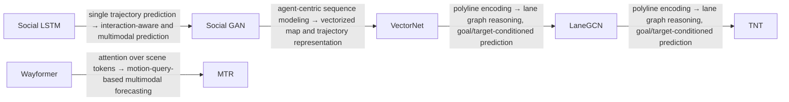

### Reading Order

1. [Social LSTM: Human Trajectory Prediction in Crowded Spaces](https://arxiv.org/abs/1603.06142), CVPR 2016  
   Skim for: <kbd>trajectory prediction</kbd>, <kbd>social interaction</kbd>, <kbd>sequence modeling</kbd>

2. [Social GAN: Socially Acceptable Trajectories with Generative Adversarial Networks](https://arxiv.org/abs/1803.10892), CVPR 2018  
   Skim for: <kbd>multimodal trajectory prediction</kbd>, <kbd>social pooling</kbd>

3. [VectorNet: Encoding HD Maps and Agent Dynamics from Vectorized Representation](https://arxiv.org/abs/2005.04259), CVPR 2020  
   Skim for: <kbd>vectorized map</kbd>, <kbd>polyline representation</kbd>, <kbd>agent-map interaction</kbd>

4. [Learning Lane Graph Representations for Motion Forecasting](https://arxiv.org/abs/2007.13732), ECCV 2020  
   Skim for: <kbd>LaneGCN</kbd>, <kbd>lane graph</kbd>, <kbd>agent-lane interaction</kbd>

5. [TNT: Target-driven Trajectory Prediction](https://arxiv.org/abs/2008.08294), CoRL 2020  
   Skim for: <kbd>target candidates</kbd>, <kbd>goal-conditioned prediction</kbd>

6. [Wayformer: Motion Forecasting via Simple & Efficient Attention Networks](https://arxiv.org/abs/2207.05844), ICRA 2023  
   Skim for: <kbd>attention</kbd>, <kbd>map-agent tokens</kbd>, <kbd>trajectory forecasting</kbd>

7. [Motion Transformer with Global Intention Localization and Local Movement Refinement](https://arxiv.org/abs/2209.13508), NeurIPS 2022  
   Skim for: <kbd>MTR</kbd>, <kbd>motion queries</kbd>, <kbd>multimodal trajectory prediction</kbd>

### YouTube Skim Resources

- [Motion forecasting autonomous driving lecture search](https://www.youtube.com/results?search_query=motion+forecasting+autonomous+driving+trajectory+prediction+lecture+VectorNet+LaneGCN)  
  Use this to understand trajectory prediction and map-conditioned forecasting.

- [Trajectory prediction multimodal forecasting search](https://www.youtube.com/results?search_query=multimodal+trajectory+prediction+autonomous+driving+paper+explained)  
  Use this after VectorNet and LaneGCN.

## 9. Planning and Control

### Field Evolution

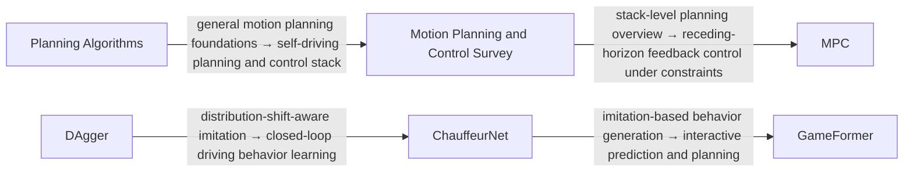

### Reading Order

1. [Planning Algorithms](http://lavalle.pl/planning/), Steven M. LaValle  
   Skim for: <kbd>configuration space</kbd>, <kbd>sampling-based planning</kbd>, <kbd>motion planning</kbd>

2. [A Survey of Motion Planning and Control Techniques for Self-driving Urban Vehicles](https://arxiv.org/abs/1604.07446), IEEE T-IV 2016  
   Skim for: <kbd>behavior planning</kbd>, <kbd>motion planning</kbd>, <kbd>control stack</kbd>

3. [Model Predictive Control: Theory, Computation, and Design](https://sites.engineering.ucsb.edu/~jbraw/mpc/), Rawlings, Mayne, and Diehl  
   Skim for: <kbd>MPC</kbd>, <kbd>constraints</kbd>, <kbd>receding horizon</kbd>

4. [A Reduction of Imitation Learning and Structured Prediction to No-Regret Online Learning](https://arxiv.org/abs/1011.0686), AISTATS 2011  
   Skim for: <kbd>DAgger</kbd>, <kbd>covariate shift</kbd>, <kbd>interactive imitation learning</kbd>

5. [ChauffeurNet: Learning to Drive by Imitating the Best and Synthesizing the Worst](https://arxiv.org/abs/1812.03079), 2018  
   Skim for: <kbd>imitation learning</kbd>, <kbd>synthetic perturbations</kbd>, <kbd>closed-loop behavior</kbd>

6. [GameFormer: Game-theoretic Modeling and Learning of Transformer-based Interactive Prediction and Planning](https://arxiv.org/abs/2303.05760), ICCV 2023  
   Skim for: <kbd>interactive prediction</kbd>, <kbd>planning</kbd>, <kbd>game-theoretic reasoning</kbd>

### YouTube Skim Resources

- [Motion planning lecture search](https://www.youtube.com/results?search_query=motion+planning+robotics+lecture+RRT+trajectory+optimization)  
  Use this for classical planning vocabulary.

- [Model predictive control lecture search](https://www.youtube.com/results?search_query=model+predictive+control+lecture+robotics+autonomous+driving)  
  Use this before reading learning-based planning papers.

- [Autonomous driving planning lecture search](https://www.youtube.com/results?search_query=autonomous+driving+planning+and+control+lecture)  
  Use this to connect forecasting, planning, and control.

## 10. Robot Learning

### Field Evolution

```mermaid
flowchart LR
    s10n1["Learning from Demonstration Survey"]
    s10n2["DAgger"]
    s10n3["Deep Visuomotor Policies"]
    s10n4["RT-1"]
    s10n5["Decision Transformer"]
    s10n6["Diffusion Policy"]
    s10n7["RT-2"]
    s10n8["Open X-Embodiment"]
    s10n9["OpenVLA"]
    s10n1 -->|"offline demonstration learning → interactive correction and distribution-shift reduction"| s10n2
    s10n2 -->|"interactive imitation learning → end-to-end visual policy learning"| s10n3
    s10n3 -->|"task-specific policies → large-scale language-conditioned robot policies"| s10n4
    s10n5 -->|"trajectory sequence modeling → generative action modeling"| s10n6
    s10n4 -->|"robot transformer policies → VLA transfer, cross-embodiment data, open VLA models"| s10n7
    s10n7 -->|"robot transformer policies → VLA transfer, cross-embodiment data, open VLA models"| s10n8
    s10n8 -->|"robot transformer policies → VLA transfer, cross-embodiment data, open VLA models"| s10n9
```

### Reading Order

1. [A Survey of Robot Learning from Demonstration](https://www.sciencedirect.com/science/article/pii/S0921889008001772), Robotics and Autonomous Systems 2009  
   Skim for: <kbd>learning from demonstration</kbd>, <kbd>imitation learning</kbd>, <kbd>policy learning</kbd>

2. [A Reduction of Imitation Learning and Structured Prediction to No-Regret Online Learning](https://arxiv.org/abs/1011.0686), AISTATS 2011  
   Skim for: <kbd>DAgger</kbd>, <kbd>covariate shift</kbd>, <kbd>interactive imitation learning</kbd>

3. [End-to-End Training of Deep Visuomotor Policies](https://arxiv.org/abs/1504.00702), JMLR 2016  
   Skim for: <kbd>visuomotor policies</kbd>, <kbd>end-to-end robot learning</kbd>

4. [Decision Transformer: Reinforcement Learning via Sequence Modeling](https://arxiv.org/abs/2106.01345), NeurIPS 2021  
   Skim for: <kbd>offline RL</kbd>, <kbd>trajectory sequence modeling</kbd>, <kbd>return conditioning</kbd>

5. [RT-1: Robotics Transformer for Real-World Control at Scale](https://arxiv.org/abs/2212.06817), RSS 2023  
   Skim for: <kbd>large-scale robot data</kbd>, <kbd>robotics transformer</kbd>, <kbd>language-conditioned control</kbd>

6. [Diffusion Policy: Visuomotor Policy Learning via Action Diffusion](https://arxiv.org/abs/2303.04137), RSS 2023 / IJRR 2024  
   Skim for: <kbd>action diffusion</kbd>, <kbd>receding-horizon control</kbd>, <kbd>multimodal action distributions</kbd>

7. [RT-2: Vision-Language-Action Models Transfer Web Knowledge to Robotic Control](https://arxiv.org/abs/2307.15818), CoRL 2023  
   Skim for: <kbd>VLA model</kbd>, <kbd>robot actions as tokens</kbd>, <kbd>web knowledge transfer</kbd>

8. [Open X-Embodiment: Robotic Learning Datasets and RT-X Models](https://arxiv.org/abs/2310.08864), 2023  
   Skim for: <kbd>cross-embodiment learning</kbd>, <kbd>robot data mixture</kbd>, <kbd>RT-X</kbd>

9. [OpenVLA: An Open-Source Vision-Language-Action Model](https://arxiv.org/abs/2406.09246), CoRL 2024  
   Skim for: <kbd>open VLA training</kbd>, <kbd>parameter-efficient adaptation</kbd>, <kbd>robot action generation</kbd>

### YouTube Skim Resources

- [Robot learning lecture search](https://www.youtube.com/results?search_query=robot+learning+lecture+imitation+learning+behavior+cloning+visuomotor+policy)  
  Use this for imitation learning and visuomotor policy basics.

- [Diffusion Policy paper explanation search](https://www.youtube.com/results?search_query=Diffusion+Policy+visuomotor+policy+learning+paper+explained)  
  Focus on action diffusion and receding-horizon execution.

- [RT-1 RT-2 OpenVLA explanation search](https://www.youtube.com/results?search_query=RT-1+RT-2+OpenVLA+vision+language+action+model+explained)  
  Use this for modern VLA-style robot learning.

## 11. Foundation Models for Vision and Robotics

### Field Evolution

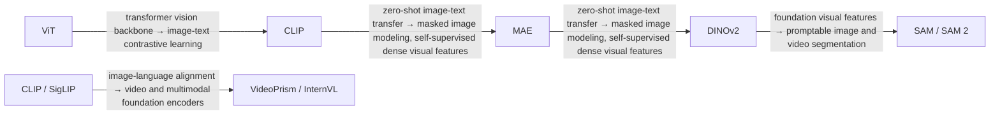

### Reading Order

1. [An Image is Worth 16x16 Words: Transformers for Image Recognition at Scale](https://arxiv.org/abs/2010.11929), ICLR 2021  
   Skim for: <kbd>ViT</kbd>, <kbd>patch tokens</kbd>, <kbd>scale</kbd>

2. [Learning Transferable Visual Models From Natural Language Supervision](https://arxiv.org/abs/2103.00020), ICML 2021  
   Skim for: <kbd>CLIP</kbd>, <kbd>image-text contrastive learning</kbd>, <kbd>zero-shot transfer</kbd>

3. [Masked Autoencoders Are Scalable Vision Learners](https://arxiv.org/abs/2111.06377), CVPR 2022  
   Skim for: <kbd>masked image modeling</kbd>, <kbd>asymmetric encoder-decoder</kbd>

4. [DINOv2: Learning Robust Visual Features without Supervision](https://arxiv.org/abs/2304.07193), TMLR 2024  
   Skim for: <kbd>self-supervised features</kbd>, <kbd>curated data</kbd>, <kbd>dense transfer</kbd>

5. [Sigmoid Loss for Language Image Pre-Training](https://arxiv.org/abs/2303.15343), ICCV 2023  
   Skim for: <kbd>SigLIP</kbd>, <kbd>scalable image-text loss</kbd>

6. [Segment Anything](https://arxiv.org/abs/2304.02643), ICCV 2023  
   Skim for: <kbd>promptable segmentation</kbd>, <kbd>foundation task</kbd>

7. [SAM 2: Segment Anything in Images and Videos](https://arxiv.org/abs/2408.00714), 2024  
   Skim for: <kbd>video foundation segmentation</kbd>, <kbd>memory</kbd>

8. [VideoPrism: A Foundational Visual Encoder for Video Understanding](https://arxiv.org/abs/2402.13217), 2024  
   Skim for: <kbd>video representation learning</kbd>, <kbd>video foundation encoder</kbd>

9. [InternVL: Scaling up Vision Foundation Models and Aligning for Generic Visual-Linguistic Tasks](https://arxiv.org/abs/2312.14238), CVPR 2024  
   Skim for: <kbd>VLM alignment</kbd>, <kbd>vision encoder scaling</kbd>

### YouTube Skim Resources

- [Stanford CS231n 2025 Lecture 8: Attention and Transformers](https://www.youtube.com/watch?v=RQowiOF_FvQ)  
  Best first video before ViT, MAE, DINOv2, and SAM.

- [CLIP paper explanation search](https://www.youtube.com/results?search_query=CLIP+paper+explained+contrastive+language+image+pretraining)  
  Focus on contrastive loss and zero-shot evaluation.

- [DINOv2 paper explanation search](https://www.youtube.com/results?search_query=DINOv2+paper+explained+computer+vision+foundation+model)  
  Use this after CLIP and MAE.

## 12. End-to-End Autonomous Driving

### Field Evolution

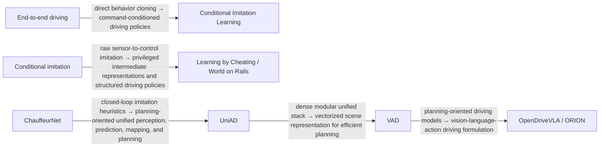

### Reading Order

1. [End-to-end Learning of Driving Models from Large-scale Video Datasets](https://arxiv.org/abs/1612.01079), CVPR 2017  
   Skim for: <kbd>large-scale imitation learning</kbd>, <kbd>driving</kbd>, <kbd>behavior cloning</kbd>

2. [End-to-end Driving via Conditional Imitation Learning](https://arxiv.org/abs/1710.02410), ICRA 2018  
   Skim for: <kbd>command-conditioned policy</kbd>, <kbd>imitation learning</kbd>, <kbd>urban driving</kbd>

3. [Learning by Cheating](https://arxiv.org/abs/1912.12294), CoRL 2019  
   Skim for: <kbd>privileged information</kbd>, <kbd>student policy</kbd>, <kbd>intermediate representation</kbd>

4. [World on Rails: Safe and Interpretable Autonomous Driving via Fully Waypoint-based Imitation Learning](https://arxiv.org/abs/2105.00636), ICCV 2021  
   Skim for: <kbd>waypoint policy</kbd>, <kbd>structured imitation</kbd>, <kbd>interpretable driving</kbd>

5. [ChauffeurNet: Learning to Drive by Imitating the Best and Synthesizing the Worst](https://arxiv.org/abs/1812.03079), 2018  
   Skim for: <kbd>closed-loop driving behavior</kbd>, <kbd>synthetic data</kbd>, <kbd>imitation learning</kbd>

6. [Planning-Oriented Autonomous Driving](https://openaccess.thecvf.com/content/CVPR2023/html/Hu_Planning-Oriented_Autonomous_Driving_CVPR_2023_paper.html), CVPR 2023  
   Skim for: <kbd>UniAD</kbd>, <kbd>perception</kbd>, <kbd>prediction</kbd>, <kbd>mapping</kbd>, <kbd>planning</kbd>

7. [VAD: Vectorized Scene Representation for Efficient Autonomous Driving](https://arxiv.org/abs/2303.12077), ICCV 2023  
   Skim for: <kbd>vectorized scene representation</kbd>, <kbd>planning-oriented driving</kbd>

8. [OpenDriveVLA: Towards End-to-End Autonomous Driving with Large Vision Language Action Model](https://arxiv.org/abs/2503.23463), 2025  
   Skim for: <kbd>VLA framing</kbd>, <kbd>autonomous driving</kbd>, <kbd>action generation</kbd>

9. [ORION: A Holistic End-to-End Autonomous Driving Framework by Vision-Language Instructed Action Generation](https://arxiv.org/abs/2503.19755), 2025  
   Skim for: <kbd>language-instructed driving</kbd>, <kbd>action generation</kbd>

### YouTube Skim Resources

- [UniAD paper explanation search](https://www.youtube.com/results?search_query=UniAD+Planning-Oriented+Autonomous+Driving+paper+explained)  
  Use this to understand why planning is used as the organizing objective.

- [End-to-end autonomous driving lecture search](https://www.youtube.com/results?search_query=end-to-end+autonomous+driving+imitation+learning+lecture+UniAD+VAD)  
  Use this before frontier VLA-style driving papers.

## 13. Generative Vision and World Models

### Field Evolution

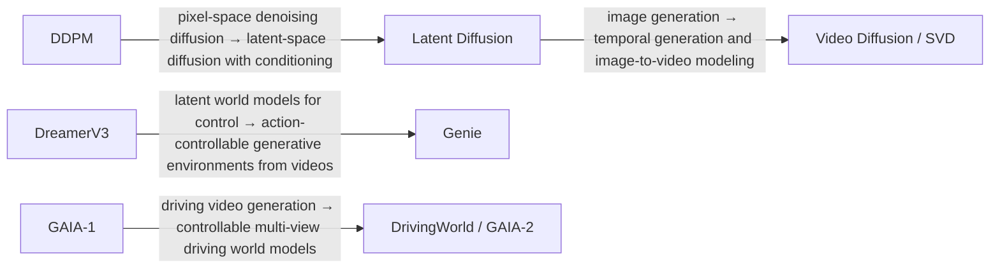

### Reading Order

1. [Denoising Diffusion Probabilistic Models](https://arxiv.org/abs/2006.11239), NeurIPS 2020  
   Skim for: <kbd>diffusion objective</kbd>, <kbd>denoising process</kbd>

2. [High-Resolution Image Synthesis with Latent Diffusion Models](https://arxiv.org/abs/2112.10752), CVPR 2022  
   Skim for: <kbd>latent diffusion</kbd>, <kbd>cross-attention conditioning</kbd>

3. [Video Diffusion Models](https://arxiv.org/abs/2204.03458), NeurIPS 2022  
   Skim for: <kbd>video diffusion</kbd>, <kbd>temporal generation</kbd>

4. [Stable Video Diffusion: Scaling Latent Video Diffusion Models to Large Datasets](https://arxiv.org/abs/2311.15127), 2023  
   Skim for: <kbd>image-to-video</kbd>, <kbd>latent video diffusion</kbd>

5. [Mastering Diverse Domains through World Models](https://arxiv.org/abs/2301.04104), 2023  
   Skim for: <kbd>DreamerV3</kbd>, <kbd>latent imagination</kbd>, <kbd>control</kbd>

6. [Genie: Generative Interactive Environments](https://arxiv.org/abs/2402.15391), ICML 2024  
   Skim for: <kbd>action-controllable environments</kbd>, <kbd>unlabeled videos</kbd>

7. [GAIA-1: A Generative World Model for Autonomous Driving](https://arxiv.org/abs/2309.17080), 2023  
   Skim for: <kbd>generative driving simulation</kbd>, <kbd>driving videos</kbd>

8. [DrivingWorld: Constructing World Model for Autonomous Driving via Video GPT](https://arxiv.org/abs/2412.19505), 2024  
   Skim for: <kbd>video-token world modeling</kbd>, <kbd>driving</kbd>

9. [GAIA-2: A Controllable Multi-View Generative World Model for Autonomous Driving](https://arxiv.org/abs/2503.20523), 2025  
   Skim for: <kbd>controllable multi-view generation</kbd>, <kbd>driving world generation</kbd>

### YouTube Skim Resources

- [DDPM basics video](https://www.youtube.com/watch?v=h6T1UU9pzOY)  
  Good first skim for diffusion mechanics.

- [Genie world model explanation search](https://www.youtube.com/results?search_query=Genie+Generative+Interactive+Environments+world+model+explained)  
  Use this for interactive world-model intuition.

- [GAIA driving world model explanation search](https://www.youtube.com/results?search_query=GAIA+generative+world+model+autonomous+driving+explained)  
  Use this for driving-specific world-model framing.

## 14. Robustness, Uncertainty, and Safety

This section focuses on failure awareness and safety for autonomous driving and robotics. It intentionally avoids a heavy adversarial-attack track and instead emphasizes uncertainty, calibration, OOD detection, test-time adaptation, and control-level safety constraints.

### Field Evolution

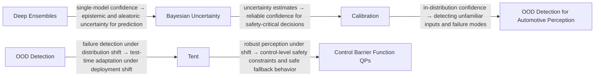

### Reading Order

1. [Simple and Scalable Predictive Uncertainty Estimation using Deep Ensembles](https://papers.neurips.cc/paper/7219-simple-and-scalable-predictive-uncertainty-estimation-using-deep-ensembles), NeurIPS 2017  
   Skim for: <kbd>ensemble uncertainty</kbd>, <kbd>calibration</kbd>, <kbd>OOD behavior</kbd>

2. [What Uncertainties Do We Need in Bayesian Deep Learning for Computer Vision?](https://arxiv.org/abs/1703.04977), NeurIPS 2017  
   Skim for: <kbd>epistemic uncertainty</kbd>, <kbd>aleatoric uncertainty</kbd>, <kbd>dense prediction</kbd>

3. [On Calibration of Modern Neural Networks](https://arxiv.org/abs/1706.04599), ICML 2017  
   Skim for: <kbd>confidence calibration</kbd>, <kbd>temperature scaling</kbd>, <kbd>reliability diagrams</kbd>

4. [Out-of-Distribution Detection for Automotive Perception](https://arxiv.org/abs/2011.01413), 2020  
   Skim for: <kbd>OOD detection</kbd>, <kbd>automotive perception</kbd>, <kbd>safe fallback trigger</kbd>, <kbd>real-time constraints</kbd>

5. [Tent: Fully Test-time Adaptation by Entropy Minimization](https://arxiv.org/abs/2006.10726), ICLR 2021  
   Skim for: <kbd>test-time adaptation</kbd>, <kbd>entropy minimization</kbd>, <kbd>batch-norm adaptation</kbd>, <kbd>deployment shift</kbd>

6. [Control Barrier Function Based Quadratic Programs for Safety Critical Systems](https://arxiv.org/abs/1609.06408), IEEE TAC 2017  
   Skim for: <kbd>control barrier functions</kbd>, <kbd>forward invariance</kbd>, <kbd>safety constraints</kbd>, <kbd>CLF-CBF-QP</kbd>, <kbd>adaptive cruise control</kbd>

### YouTube Skim Resources

- [Uncertainty in deep learning lecture search](https://www.youtube.com/results?search_query=uncertainty+in+deep+learning+deep+ensembles+calibration+lecture)  
  Use before Deep Ensembles, Bayesian uncertainty, and calibration.

- [OOD detection autonomous driving search](https://www.youtube.com/results?search_query=out+of+distribution+detection+autonomous+driving+perception+lecture)  
  Use this to connect OOD detection with road-scene perception and failure modes.

- [Control barrier functions lecture search](https://www.youtube.com/results?search_query=control+barrier+functions+safety+critical+control+lecture+robotics+autonomous+driving)  
  Use this after the planning/control section if the CLF-CBF-QP formulation is unfamiliar.
